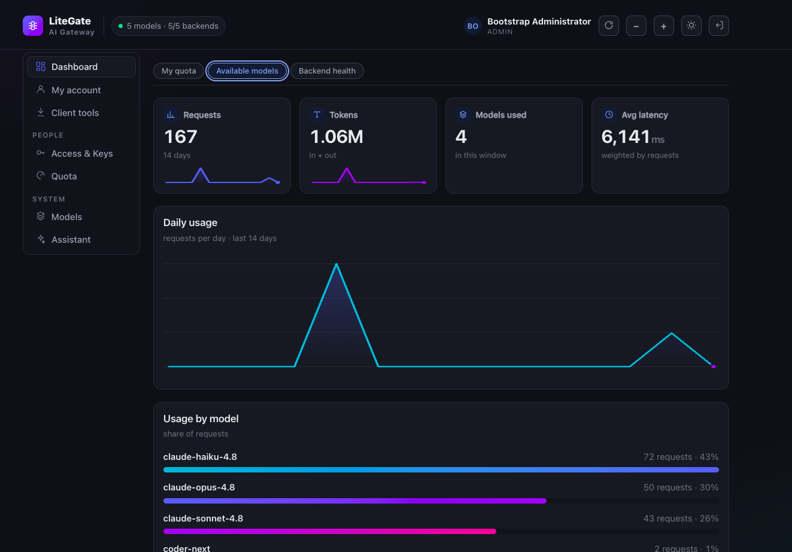
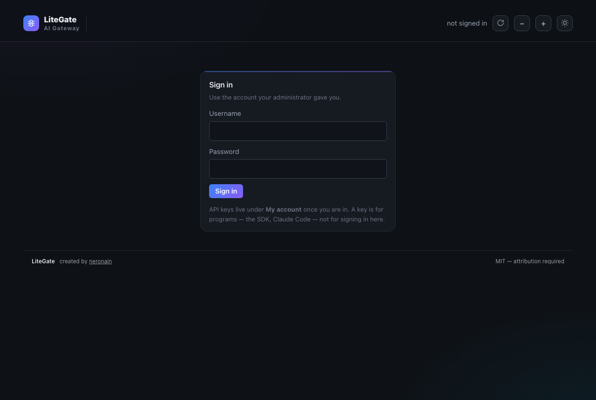

<div align="center">

# LiteGate

**One door in front of your own GPUs — with identity, policy, quota and proof that each model can do what it claims**

Put your model servers behind the standard **OpenAI** and **Anthropic** APIs.
Members get an alias and a key; you keep the machines, the limits and the audit trail.

[](https://github.com/neronain/AiGatewayLocal/actions/workflows/ci.yml)
[](pyproject.toml)
[](tests/)
[](pyproject.toml)
[](docs/API.md)
[](LICENSE)

**[Deploy](docs/DEPLOYMENT.md)** · **[API](docs/API.md)** · **[Ports & network](docs/NETWORK.md)** · **[Architecture](docs/ARCHITECTURE.md)** · **[Runbook](docs/RUNBOOK.md)** · **[LMDS — the deploy side](https://github.com/neronain/AutoDeployDGXProject)**

Created and maintained by **neronain** — [facebook.com/neronain.minidev](https://www.facebook.com/neronain.minidev)
MIT licensed. See [LICENSE](LICENSE) and [NOTICE](NOTICE).

</div>

---

You have GPUs and a handful of people who need them — a small company, an agency,
a research group, a university department. Today that usually means an open port
and an honour system.

LiteGate puts one HTTPS endpoint in front of those machines. Every caller has a
key, every key has a scope and a quota, every request is accounted for, and
nobody ever learns the hostname or the repository name of whatever answered them.
It speaks the OpenAI and Anthropic APIs, so the SDKs, Claude Code and Codex work
against it unchanged.

```
    Members                       LiteGate                    Your GPUs
┌─────────────┐          ┌────────────────────────┐        ┌──────────────┐
│ Python SDK  │          │ Auth · Workspace policy│        │ vLLM         │
│ Claude Code │ ─HTTPS─▶ │ Capability · Quota     │ ─────▶ │ llama.cpp    │
│ Web / App   │          │ Routing · Failover     │        │ Ollama/SGLang│
└─────────────┘          └────────────────────────┘        └──────────────┘
      alias only            policy + accounting               inference
```

| You have | LiteGate gives you |
|---|---|
| One GPU box shared by a small team | Per-person keys and quota instead of an open port |
| Several nodes with different models | One alias per job (`coding`, `vision`) that survives model swaps — and fails over between nodes |
| A class, a department, or client projects | Workspaces and access groups, each with its own models and limits |
| Claude Code users and OpenAI-SDK users | Both, against the same backend, without changing the backend |
| A RAG index to build | `/v1/embeddings` and `/v1/rerank` behind the same key and quota as everything else |

**Requirements:** Python **3.10 or newer** — which covers Ubuntu 22.04 LTS
(3.10), 24.04 (3.12) and 25.x (3.13); CI tests all four. Linux, a container, or
macOS for evaluation. No GPU is needed to run the gateway itself.

---

## What it looks like

<div align="center">


<sub>The landing page at <code>/</code>. It reports the live state of this
deployment — here, eight models ready — and offers exactly two doors: the admin
console, and a member self-check that needs no account. The <code>curl</code> at
the bottom is built from the address the browser actually used, so it can be
copied and run as-is.</sub>

<br><br>



<sub><code>/console/member/</code> — a member pastes their own API key and sees
the key's name and age, how much of the quota window is left across requests,
input tokens, output tokens and images, which models they may call and what each
one can do, and fourteen days of their own usage. No account, and no ticket to an
administrator. (The figures shown are demo data.)</sub>

</div>

---

## What it does

| | |
|---|---|
| 🧩 **Capability registry** | Models declare what they *can do* (`vision`, `tools`, `agentic`), not what they *are*. Adding a model is one YAML file — no code change. |
| ⛔ **Fails fast, not downstream** | Send an image to a text-only model and you get a `400` with an actionable message. The backend never sees the request. |
| 🖼 **Multimodal from day one** | Text + image content blocks, streaming, on both the OpenAI and Anthropic surfaces. |
| 🔎 **Retrieval, not just chat** | `/v1/embeddings` and `/v1/rerank` pass the same key, quota and usage log as chat — so the heaviest part of a RAG pipeline stops being the one part nobody is watching. |
| 🏷 **Stable aliases** | Members use `coding`. Admins repoint it from one model to another with zero member-side change. Repository names are never member-visible. |
| ♻️ **Failover between endpoints** | Two machines behind one alias take over for each other — retried only before the first byte is streamed, so nobody sees half an answer twice. |
| 📊 **Real quota** | Per member, workspace, model or group — over requests, text tokens, **visual tokens**, output tokens and images, plus per-minute rate limits. |
| 🤖 **Claude Code and Codex work** | `/v1/messages` and `/v1/responses` are served even when the backend speaks only OpenAI. The gateway translates both ways, streaming included. |
| 🔒 **Private by default** | No prompt, no response, no image is ever written to disk. The schema has no column for them. |
| 🔔 **Says when it is behind** | The console compares the running version against the latest release — **only when an administrator presses the button**. Nothing leaves the machine otherwise. |

---

## Quick start

Two different jobs, two different commands. Running the wrong one is the most
common way this install goes wrong, so pick before you start:

| You want to | Run | What you get |
|---|---|---|
| **See what it does**, on a laptop, no GPU | `./install.sh --demo` | Runs in your terminal until you press Ctrl-C. Nothing is installed system-wide. |
| **Actually run it** for a team | `sudo scripts/bootstrap.sh` | systemd service, TLS, survives a reboot, starts with no models until you add yours. |

```bash
git clone https://github.com/neronain/AiGatewayLocal.git
cd AiGatewayLocal
./install.sh --demo          # or: sudo scripts/bootstrap.sh
```

`--demo` exists because a gateway with nothing behind it cannot be evaluated:
every request 502s and the thing looks broken when it is merely empty. The flag
starts a **stand-in backend**, repoints the sample aliases at it, sends one real
request through `/v1/chat/completions` to prove the path works end to end, and
prints the console URL with credentials. The answers come from a script, not a
model — it is for seeing the console, the quota screens and the API surface, not
for measuring anything.

`bootstrap.sh` is the real install: service account, `/opt/litegate`, secrets, a
systemd unit, a TLS certificate, started. **The sample models ship disabled on
this path** — they name machines on our network, and a fresh install that keeps
probing them fills your log with errors on day one. Add your own in the console,
or point the sample files at your backends and switch them back on.

Either path prints a bootstrap admin key once.

```bash
export KEY=lg_sk_...

curl -s -X POST http://localhost:8080/v1/chat/completions \
  -H "Authorization: Bearer $KEY" -H 'Content-Type: application/json' \
  -d '{"model":"coding","messages":[{"role":"user","content":"Reply with exactly: OK"}]}'
```

Console at <http://localhost:8080/console>, API reference at `/docs`. Lost the
console password? `.venv/bin/python scripts/reset_password.py admin` on the host.

<details>
<summary>Running the pieces yourself</summary>

```bash
./install.sh --no-start      # venv, .env, config — nothing started

.venv/bin/python scripts/mock_backend.py --port 8000    # terminal 1
.venv/bin/uvicorn app.main:app --port 8080              # terminal 2
```

`--port` moves the gateway, `LITEGATE_MOCK_PORT` moves the stand-in backend.

</details>

### HTTPS is part of installing, not a retrofit

A growing number of clients refuse plain HTTP outright — browser APIs gated on a
secure context, editor extensions, anything treating `http://` as a
misconfiguration. So `bootstrap.sh` finishes by running:

```bash
sudo scripts/install_tls.sh                          # detects this host's names
sudo scripts/install_tls.sh gateway.example.ac.th    # plus a name you own
sudo scripts/install_tls.sh --cert /path/fullchain.pem --key /path/privkey.pem
```

With no arguments it finds the hostname and LAN addresses, adds `localhost` and
`127.0.0.1`, shows the list and asks whether to add anything — press Enter and
you are done. A domain is not required; a LAN address is a perfectly good name on
a certificate. You get `:443` TLS (the address you hand out), `:80` redirecting
to it, and `:8080` still plain for scripts and health checks. Reissuing after a
rename needs `--force`: a certificate that has not expired is not the same as one
that still covers the address you are using.

Nginx-dialect handling, the stock `default` site, HSTS, and the private CA on
client machines: **[DEPLOYMENT.md §5c](docs/DEPLOYMENT.md#5c-tls)**. Docker
Compose, Postgres + Redis, LXC, read-only filesystems, backup and restore,
monitoring: **[DEPLOYMENT.md](docs/DEPLOYMENT.md)**.

---

## Pointing clients at it

The gateway serves `/v1/messages`, so **Claude Code** talks to it directly:

```bash
export ANTHROPIC_BASE_URL=http://127.0.0.1:8080
export ANTHROPIC_AUTH_TOKEN=lg_sk_...
export ANTHROPIC_MODEL=coding
claude
```

**Codex** speaks the Responses API — a different protocol from the one Claude
Code uses, not a different endpoint of the same one. The gateway serves
`/v1/responses` and translates to chat completions on the way out and back on the
way in, streaming included:

```bash
export OPENAI_BASE_URL=http://127.0.0.1:8080/v1
export OPENAI_API_KEY=lg_sk_...
codex --model coding
```

Enable each surface per alias (`spec.protocols: { openai, anthropic, responses,
embeddings, rerank }`). `GET /v1/models` reports which ones an alias exposes, so
a client can check rather than guess — guessing wrong means a `400` after the
prompt is already typed.

> **`previous_response_id` returns `400` rather than pretending to work.** Codex
> uses it to have the server keep the conversation, but this gateway writes no
> prompt and no response to disk (PRD §12), so there is no head to continue from.
> Codex sends the full input every turn when that mode is off.

**Getting a trusted address to the client.** Claude's third-party provider
settings refuse anything that is not https, or http on loopback — a plain LAN
address is rejected outright. Three ways in; pick by where the client runs:

| The client runs | Use | What it costs |
|---|---|---|
| On the gateway host itself | `http://127.0.0.1:8080` | nothing — no certificate involved |
| On another machine you control | `https://<host>` + [your own CA](docs/DEPLOYMENT.md#certificates-for-clients-on-other-machines) | install one file on each client |
| Anywhere, or you want a real name | `cloudflared tunnel --url http://localhost:8080` | the endpoint becomes reachable from the internet while it runs |

A gateway in a VM whose ports are published to the host — OrbStack, Docker
Desktop, `ssh -L` — already satisfies the loopback rule. On the CA route, mind the
Electron trap: Node and Chromium read different trust stores, so a desktop app
needs the system store, not just `NODE_EXTRA_CA_CERTS`. On the tunnel route the
API key is still required, but close it afterwards and use a named tunnel with
Cloudflare Access in front for anything lasting —
**[docs/CLAUDE-TUNNEL.md](docs/CLAUDE-TUNNEL.md)** walks it and lists every error
it produces.

---

## Accounts and keys

<div align="center">



<sub><code>/console/</code> — the operator sign-in. The note under the button is
doing real work: it tells people an <code>lg_sk_…</code> key is for
<em>programs</em>, not for signing in here, which is the most common first-time
mistake on any gateway that has both.</sub>

</div>

| | API key (`lg_sk_…`) | Console sign-in |
|---|---|---|
| Authenticates | a **program** — SDK, Claude Code, curl | a **person** in a browser |
| Lives in | a config file or `.env` | the operator's head |
| Lifetime | long (default 180 days, extendable) | 8 hours |
| How many | several — one per machine or project | one session |
| If it leaks | revoke that key; other work is unaffected | sign out, change password |

On first start the console asks for a username and password rather than a token,
and creates the first administrator. Set `GW_ADMIN_USER` / `GW_ADMIN_PASSWORD` to
choose them; otherwise a password is generated and printed once.

### What each role can do

| | member | manager | admin |
|---|---|---|---|
| See the models they may use, and their own quota | ✅ | ✅ | ✅ |
| Issue, name and revoke **their own** API keys | ✅ | ✅ | ✅ |
| Manage people **in their own workspaces**, issue keys for them | — | ✅ | ✅ |
| Choose which models those workspaces may use | — | ✅ | ✅ |
| Set quota and read usage **for those workspaces** | — | ✅ | ✅ |
| Add, edit, disable or delete models in the registry | — | — | ✅ |
| Verify backends, run the model test suite, reload the registry | — | — | ✅ |

The line is deliberate: **a manager decides who may use what; an admin decides
what exists.** Adding a model touches GPUs and machine configuration, which is
not a people-management decision. A manager's reach stops at the workspaces they
actually run — they cannot see, quota or issue keys for anyone outside them.

**Reading a key back.** By default only a digest is stored, so a lost key can only
be replaced — which means finding every config file and CI secret that held the
old one. Set `GW_KEY_REVEAL_SECRET` and a sealed second copy is kept that an
**administrator** (not a manager) can open from the console. The trade, plainly: a
leaked database dump alone still reveals nothing, because the seal key is not in
it; a host compromise reaching both the dump and the environment reveals every
sealed key at once — which is why it is off unless switched on. Reveal never works
on a revoked key, every opening is recorded and shown beside the key, and keys
issued before it was enabled stay unreadable and say so.
[Details](docs/DEPLOYMENT.md#reading-an-issued-key-back-optional).

---

## Deciding who may use what

Three tools that compose, rather than three ways to do the same thing:

| | What it is | Use it for |
|---|---|---|
| **Workspace** | A group of people with allowed models, defaults and a status | A team, a client project, a class |
| **Access group** | A named bundle of models (`vision-set`, `coding-set`) | Granting several models at once, and quota-ing them together |
| **Quota policy** | A named limit, optionally scoped and dated | "Launch week", "urgent, 3 days" |

Permission **narrows** through every rule it passes — key, workspace, group — so
no layer can widen what an earlier one withheld. Quota does the opposite and
picks exactly one winner, most specific first:

```
user+model  >  user+group  >  user  >  workspace+model  >  workspace+group  >  workspace  >  global
```

Usage is drawn against the limit that will actually stop someone — the tightest
of them, not the roomiest — so the bar never reads "plenty left" right up to the
refusal.

Consequences that are easy to get wrong, and are tested:

- **Suspending a workspace** removes its models from its members; it does not make
  them unrestricted. (A real bug once: filtering on the wrong side made a suspended
  class read as "in no group at all".)
- **An expired key is kept, not deleted** — extend it with a button, counting days
  from today. Quota policies expire too: a limit nobody removes is still in force
  next quarter.
- **A key's models can be changed after it is issued**, both directions, on a
  credential already in circulation. Without that, adding one model meant revoking
  something that worked and chasing down everywhere it had been pasted — so people
  issued wide keys up front, the opposite of what a scope is for. An empty list
  means unrestricted, and the dialog says so before you save.
- **A spent allowance can be handed back** without raising anyone's limit — admin
  only, audit-logged, usage records untouched. One runaway loop can burn a month's
  quota on a Tuesday afternoon; the limit was not wrong and the person is blocked
  now. A reset that erased its own evidence would be a quiet way to grant
  unlimited access.
- **Enrolling thirty people is not thirty decisions.** A workspace carries the
  models, key lifetime and groups a new key starts with, and the console reports
  which defaults it applied.

---

## For members

```python
from openai import OpenAI

client = OpenAI(base_url="https://gateway.example.ac.th/v1", api_key="lg_sk_...")

client.chat.completions.create(
    model="coding",                       # an alias, not a repository name
    messages=[{"role": "user", "content": "เขียนฟังก์ชัน bubble sort ใน Python"}],
)

client.chat.completions.create(
    model="gemma-vision",
    messages=[{"role": "user", "content": [
        {"type": "text", "text": "อธิบายภาพนี้"},
        {"type": "image_url", "image_url": {"url": "data:image/png;base64,..."}},
    ]}],
)

client.embeddings.create(model="embed", input=["ประโยคแรก", "ประโยคที่สอง"])
```

### Embeddings and rerank

The heaviest part of a RAG pipeline is indexing a whole corpus, and until these
two surfaces existed it was the one part that bypassed the gateway entirely — no
key, no quota, no usage row. Four things about them are deliberate:

- **`/v1/rerank` is Cohere/Jina-shaped**, because OpenAI has no rerank endpoint
  and this is the shape vLLM and TEI actually serve. `/v1/score` and Cohere's
  `/v2/rerank` are **not** served — answering a v2 path with a v1 body is a lie.
- **Rerank charges the query once per document**, because a cross-encoder runs
  the (query, document) pair afresh for each one. A 200-token query against 50
  documents costs 10,000 tokens, not 200. That is what the backend bills.
- **The context window is checked per item, never against the batch total** — a
  500-document batch whose sum exceeds the window is ordinary indexing traffic —
  with a ceiling of **2048 items per request** (`GW_MAX_BATCH_ITEMS`; `0` lifts
  it). Quota is checked before a request runs and recorded after, so without that
  ceiling one call carrying a hundred thousand documents spends a month of
  allowance in a single shot and the limit only bites on the *next* call.
- **Neither ever fails over to a different model.** Vectors from two models are
  not comparable, so a silent substitution corrupts a customer's index with
  nothing to show for it. Failover between machines of the same alias still
  happens; neither route streams, and neither is cached.

Full reference: **[API.md](docs/API.md#post-v1embeddings)**.

---

## When a machine goes down

Two endpoints under one alias are not just load balancing — the second takes over
when the first stops answering:

```yaml
endpoints:
  - name: dgx01
    base_url: http://10.0.0.21:8000
    priority: 1                # lower wins
  - name: dgx02
    base_url: http://10.0.0.22:8000
    priority: 1                # equal priority alternates
```

- **Equal priority alternates**, so both machines stay warm.
- **Retried only before the first streamed byte.** Once a member has seen output,
  re-running the request would replay half an answer — so it does not.
- **4xx is never retried.** A malformed request is malformed on every machine.
- A response that failed over carries `x-litegate-failed-over`, so this is visible
  in logs rather than inferred from latency.

`priority`, `weight` and `max_concurrency` are editable from the console without
touching the file — and the file keeps its comments, because a registry that eats
your annotations every time you press a button is one you stop annotating.

**Routing rules** are the layer above: failover moves a request to another
*machine*, rules move it to another *model* — for a prompt longer than this
model's window, for small housekeeping calls that should not occupy a big model,
and for every machine of an alias being down at once. The member never learns it
happened: they still call `coding`, the response still echoes `coding`, and
**quota is still charged to `coding`**, because permission and quota resolve
against the requested alias *before* the rules run. A rule is an admin decision of
the same kind as repointing an alias — never a way to widen access or to make a
bill depend on internal plumbing. Syntax and guard rails:
**[ARCHITECTURE.md § Two layers of routing](docs/ARCHITECTURE.md#two-layers-of-routing)**.

---

## Adding a model

Write `config/models/<alias>.yaml` — that is the whole job:

```yaml
apiVersion: litegate.dev/v1
kind: Model
metadata:
  alias: my-model
  display_name: My Model
  visibility: member
spec:
  upstream_model: org/Model-Name-On-The-Backend
  purpose: [general]
  limits: { context_tokens: 131072, max_output_tokens: 8192 }
  modalities: { input: [text], output: [text] }
  capabilities: { chat: true, tools: true, streaming: true }
  protocols: { openai: true, anthropic: false }
  endpoints:
    - name: dgx01
      server_type: vllm
      base_url: http://10.0.0.21:8000
      protocols:  { openai: true, anthropic: false }
      modalities: { text: true, image: false }
```

Contradictions are caught at load, not at request time: `capabilities.vision: true`
without `image` in `modalities.input`, or without an endpoint that serves images,
is rejected with a specific message and the previous good registry is kept.

Then certify it — a model is `READY` because it was **measured**, never because of
its name:

```bash
python scripts/model_test_suite.py --base-url $GW --admin-key $KEY --model my-model
```

```
  MODEL-001 ... PASS      34 ms  replied 'OK'
  MODEL-002 ... PASS      10 ms  6 chunks
  MODEL-004 ... PASS      11 ms  called get_weather
  MODEL-009 ... PASS      11 ms  stop_reason=tool_use
```

A model can be **taken out of service without losing the file it lives in**: the
console toggles `enabled`, editing that one line and leaving every comment in
place.

---

## The console assistant

Bottom right of the console there is a chat box. It is not a general chatbot — it
answers from *this* deployment's state, which is the only thing a general model
cannot tell you:

> **"ทำไม request ของฉันโดน 400"**
> Your key is on the `default` quota policy and you have 0 requests left in this
> window. It resets on 1 Sep.

What it can see depends on who is asking. A member's assistant sees their own
quota and the models they may use, and nothing else — not other people's usage,
not backend hostnames, not repository names. An admin's additionally sees backend
health, registry errors and upstream model names.

It is not a way around the rules either: its requests pass the same capability
gate, quota and routing as any other caller, spend the caller's own quota, and
appear in usage. History stays in the browser tab, and the box hides itself when
no chat model is available to you — one that always answers "no backend" is worse
than no chat box.

The *Assistant* tab ranks every chat model for this job and says why: context
headroom and *not narrating* matter more here than raw capability, and a model
that cannot serve the role is refused with the failing check named.
`GW_ASSISTANT_MODEL` sets a deploy-time default.
[Details](docs/DEPLOYMENT.md#5b-the-console-assistant).

---

## Working with a deploy tool

LiteGate does not deploy models and does not want to. It measures what a running
server **actually does**, which is the one thing a deploy tool structurally cannot
check: the tool knows what it *generated*, not what the process is *doing*.

```
  deploy tool                LiteGate
  (LMDS, Ansible,     ──▶    verifies the running server
   a shell script)           and names the fix
        ▲                              │
        └──────────────────────────────┘
              you apply it
```

**Verify** re-probes every backend of a model and reports what to change, and the
probe is **engine-aware**: it reads the registry's `server_type`, so a llama.cpp
backend that did not accept tools hears about `--jinja` while a vLLM backend hears
about tool-parser flags.

```
[warning] jinja_missing
  The backend accepted a tool request but returned no tool_calls. llama.cpp
  applies the model's tool template only when started with --jinja.
  → ./<controller>.sh restart --jinja
```

A backend can also be running the *wrong* parser rather than none, which used to
read as "this model has no tool template". It has a tell: the call comes back
inside the content, in the model's own syntax. The probe now says so and names the
parser that would have read it — a mismatch is worse than no tools at all, because
the caller receives the raw call as the answer.

If an endpoint records where its backend came from — a `managed_by` block naming
the deploy tool, the node and the bundle — the advice becomes a command you can
paste rather than a placeholder. When that tool is **LMDS**, the finding also
gains an **Apply** button that asks LMDS to restart the bundle with the setting
applied.

The limits are deliberate. `managed_by` is inert: LiteGate never contacts the
deploy tool, and every model works without it. Apply reports what it *sent*, not
that it worked. LMDS answers `409` for a container it merely adopted, because it
does not own that launch command and an exit code of zero meaning "nothing
happened" is worse than an error. And only findings on a short list can be
applied — currently the tool and reasoning parsers. This is not a remote shell
with a friendly name: the payload is a parser name matched against a pattern,
sent to one bundle on one node. Field reference and the Apply contract:
**[API.md](docs/API.md#post-adminmodelsaliasapply-fix)**.

### LMDS — the deploy side of the pair

**[LMDS · Local Model Deploy Studio](https://github.com/neronain/AutoDeployDGXProject)**
downloads weights, generates the launch bundle, and runs the model on your own
machines. LiteGate is the serving and verification side. **Neither depends on the
other.**

| You install | You get |
|---|---|
| LMDS alone | Models deployed and running on your hardware, with its own console and assistant |
| LiteGate alone | One endpoint, keys, quota and capability verification in front of backends you started any way you like |
| **Both** | The loop closes — LMDS deploys, LiteGate measures the running server and names the exact command to fix it |

They meet in three optional places: `managed_by` on an endpoint, LMDS's planner
pointed at LiteGate instead of a cloud provider (`lmds config set-provider
openai-compat --base-url http://litegate:8080/v1`), and the parsers LiteGate
reports as missing being exactly the knobs LMDS exposes.

Two more repos complete the fleet:
[**dgx-spark-all-controllers**](https://github.com/neronain/dgx-spark-all-controllers)
holds the canonical launch scripts every machine syncs from, and
[**script-update**](https://github.com/neronain/script-update) stages newly
published ones for review first. LMDS deploys a model with a controller; once
proved in service that controller is promoted to canonical, where every machine
picks it up; LiteGate measures what the running model does and sends findings
back for repair.

---

## Client tools, mirrored on-premises

A customer running the gateway on their own site can get the client-side tools
that point at it — a provider switcher like
[cc-switch](https://github.com/farion1231/cc-switch), a token-saving CLI proxy
like [rtk](https://github.com/rtk-ai/rtk) — *from the gateway itself*, offline,
instead of hunting GitHub releases. They appear in the console's *เครื่องมือ* tab
as cards with a download button that detects the viewer's OS, and a Connect
button that mints a scoped key and shows the values the tool needs.

The discipline is deliberate: **mirror → verify → stage → (human) promote**, the
same two tiers the fleet uses for deploy recipes. Nothing reaches a customer on an
automatic pull — once a school runs what we hand them, we are the trust anchor, so
a compromised upstream must never flow straight through. Auto-sync is off by
design (`GW_TOOLS_AUTO_SYNC=false`), each asset declares how it is verified
(minisign against a pinned key, or SHA-256 against the release checksums), and
the curated registry is [`config/tools.yaml`](config/tools.yaml) — in git, vetted,
one entry per tool and no new code.

The mirror commands, the per-tool verification table and where the binaries land:
**[DEPLOYMENT.md §5g](docs/DEPLOYMENT.md#5g-client-tools-mirrored-on-premises)**.

---

## Staying on the current release

A production gateway once sat on 1.10.0 for weeks after 1.12.1 shipped. Nothing on
screen said so, and nobody was going to go looking. Customers install this one
machine at a time, so the console has to be the thing that notices.

**Dashboard → Version → Check for updates** (administrators only;
`POST /admin/version/check`) compares the running version against the latest
release of this repository and reports one of four things: up to date, an update
is available, newer than the latest release (a build from `main`), or it could not
tell you. It also prints **the update commands that match how this machine was
installed** — a checkout, a container, or files copied onto the host — decided
from what is on disk, so that half works with no internet at all.

Three rules the button lives under:

- **It only runs when pressed.** Nothing is checked at startup, on page load or on
  a timer; a test scans `app/` to prove the check is reachable from that one
  endpoint and nowhere else. An air-gapped install is a deliberate configuration,
  and this console does not fetch so much as a font from the internet unasked.
- **Nothing about this machine goes out.** A plain `GET` for a public repository's
  latest release: no query string, no body, no version number, no hostname, no
  identifier of any kind, compared here after the answer arrives. There is no
  telemetry in LiteGate and this did not add any. The *gateway* asks, not your
  browser — otherwise the address of whoever opened the console would reach GitHub
  on every check.
- **No internet is an answer, not an error.** A machine with no route out gets
  "could not check", the reason, and the version it is running, in a few seconds.

**There is no "update it for me" button, on purpose.** LMDS can offer one because
it is always a git checkout; LiteGate has three install shapes, and the one real
production machines use — files copied onto the host — has a five-step safe
procedure where every step exists because skipping it once caused an outage. A
button that works on some customer machines and not others is worse than no
button. The procedure, and the full privacy breakdown:
[DEPLOYMENT.md § Routine upgrade](docs/DEPLOYMENT.md#routine-upgrade).

---

## Documentation

| | |
|---|---|
| **[DEPLOYMENT.md](docs/DEPLOYMENT.md)** | Docker / systemd / LXC / staging, Postgres + Redis, TLS, backup and restore, monitoring, upgrading, troubleshooting — and [§10 Known limitations](docs/DEPLOYMENT.md#10-known-limitations), which an operator should read before trusting a metric |
| **[API.md](docs/API.md)** | Full endpoint reference with examples |
| **[NETWORK.md](docs/NETWORK.md)** | Every port and protocol the gateway speaks, who talks to whom, and what changes behind a reverse proxy or a forwarded port |
| **[ARCHITECTURE.md](docs/ARCHITECTURE.md)** | Pipeline, both layers of routing, modules, design decisions and their costs |
| **[RUNBOOK.md](docs/RUNBOOK.md)** | What to do when an alert fires — one section per alert |
| **[CLAUDE-TUNNEL.md](docs/CLAUDE-TUNNEL.md)** | Claude Developer Mode through a Cloudflare tunnel — aliases, a scoped key, cloudflared, and every error the route produces |
| **[PRD.md](docs/PRD.md)** | Requirements, data model, acceptance criteria, decision log |
| [PRD-v1.4-Access.md](docs/PRD-v1.4-Access.md) · [PRD-v1.5-Models.md](docs/PRD-v1.5-Models.md) · [PRD-v1.6-AccessControl.md](docs/PRD-v1.6-AccessControl.md) · [PRD-v1.2-Addendum.md](docs/PRD-v1.2-Addendum.md) | Decision records, kept as written: workspace membership governing access; models and endpoints measured against a running LiteLLM; access groups, named quota policies, rate limits and expiry; and the original v1.2 addendum verbatim |
| [CHANGELOG.md](CHANGELOG.md) | What changed, by date — one line per change, written from the commits |

---

## Development

```bash
make dev      # install with dev dependencies
make test     # the whole suite
make lint
make check    # what CI runs
make run      # reload server on :8080
make mock     # mock backend on :8000
```

Tests cover the capability contract, vision policy (a GIF mislabelled as PNG, the
SSRF guard on remote URLs), quota precedence and exhaustion, per-minute rate
limits, streaming on both protocols, Anthropic translation, endpoint failover,
manager scoping, the retrieval surfaces and their batch ceiling, and the guarantee
that no repository name reaches a member-visible response. Each feature was proved
by disabling it and watching the tests fail — a test that still passes with the
code removed was never checking anything.

## Project status

| Milestone | State |
|---|---|
| **M1–M4** — registry and capability validation, OpenAI and Anthropic surfaces, quota and routing, the model test suite, real hardware, Postgres + Redis, TLS, backup/restore, monitoring and the runbook | ✅ done |
| **v1.4–v1.6** — membership governs access, manager scoping, workspace status; enable/disable, endpoint priority and failover, comment-safe writes; access groups, named quota policies, rate limits, expiry | ✅ done |
| **v1.7** — client tools: on-prem mirror (verify → stage → gated promote), console *เครื่องมือ* tab | ✅ done |
| **Ops hardening** — tool-parser mismatch detection, SQLite lock under auth load, reinstall and add-model from the console | ✅ done |
| **1.12** — Python 3.10–3.13 and containers (LXC / Docker), verified against real images | ✅ done |
| **Latest** — retrieval surfaces (`/v1/embeddings`, `/v1/rerank`), batch ceiling, console version check | ✅ done |
| M5 — image upload, PDF, richer dashboard | planned |

Verified end-to-end against real backends on a live fleet, not only against the
mock: capability rejection with zero backend calls, failover between two machines,
quota and rate-limit exhaustion, and the image-type and SSRF guards.

<div align="center">
<br>

**[LMDS · the deploy side of the pair](https://github.com/neronain/AutoDeployDGXProject)** — works alone; works better alongside this

</div>
