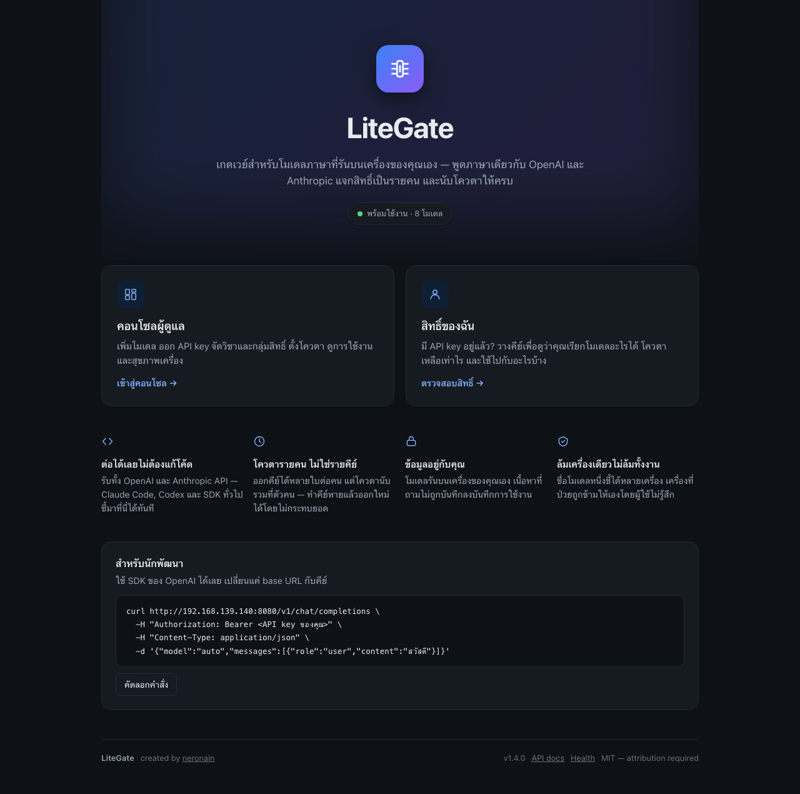
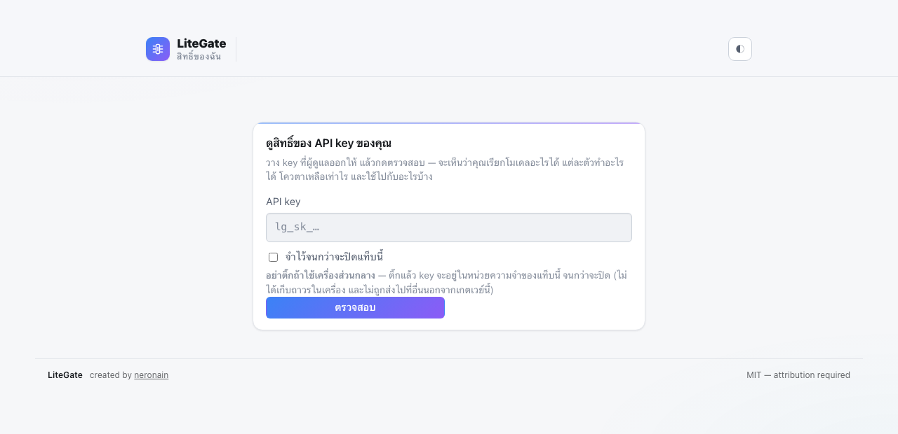

<div align="center">

# LiteGate

**One door in front of your own GPUs — with identity, policy, quota and proof that each model can do what it claims**

Put your model servers behind the standard **OpenAI** and **Anthropic** APIs.
Members get an alias and a key; you keep the machines, the limits and the audit trail.

[](https://github.com/neronain/AiGatewayLocal/actions/workflows/ci.yml)
[](pyproject.toml)
[](tests/)
[](pyproject.toml)
[](docs/API.md)
[](LICENSE)

**[Deploy](docs/DEPLOYMENT.md)** · **[API](docs/API.md)** · **[Ports & network](docs/NETWORK.md)** · **[Architecture](docs/ARCHITECTURE.md)** · **[Runbook](docs/RUNBOOK.md)** · **[LMDS — the deploy side](https://github.com/neronain/AutoDeployDGXProject)**

Created and maintained by **neronain** — [facebook.com/neronain.minidev](https://www.facebook.com/neronain.minidev)

MIT licensed — you may fork and build on this commercially, but the copyright
notice stays. See [LICENSE](LICENSE) and [NOTICE](NOTICE).

</div>

## What it looks like

<div align="center">



<sub>หน้าแรกที่ `/` — บอกสถานะจริงของระบบ และมีทางเข้าสองทางชัดเจน</sub>

<br><br>



<sub>`/console/member/` — สมาชิกวาง API key ของตัวเอง แล้วเห็นว่าใช้โมเดลอะไรได้ โควตาเหลือเท่าไร และใช้ไปกับอะไร</sub>

</div>

```
    Members                       LiteGate                    Your GPUs
┌─────────────┐          ┌────────────────────────┐        ┌──────────────┐
│ Python SDK  │          │ Auth · Workspace policy│        │ vLLM         │
│ Claude Code │ ─HTTPS─▶ │ Capability · Quota     │ ─────▶ │ llama.cpp    │
│ Web / App   │          │ Routing · Failover     │        │ Ollama/SGLang│
└─────────────┘          └────────────────────────┘        └──────────────┘
      alias only            policy + accounting               inference
```

For the case where a handful of people share a handful of GPUs — a small
company, a university department, a research group, an agency. Nothing in it
assumes a particular sector.

| You have | LiteGate gives you |
|---|---|
| One GPU box shared by a small team | Per-person keys and quota instead of an open port |
| Several nodes with different models | One alias per job (`coding`, `vision`) that survives model swaps — and fails over between nodes |
| A class, a department, or client projects | Workspaces and access groups, each with its own models and limits |
| Claude Code users and OpenAI-SDK users | Both, against the same backend, without changing the backend |

---

## What it does

| | |
|---|---|
| 🧩 **Capability registry** | Models declare what they *can do* (`vision`, `tools`, `agentic`), not what they *are*. Adding a model is one YAML file — no code change. |
| ⛔ **Fails fast, not downstream** | Send an image to a text-only model and you get a `400` with an actionable message. The backend never sees the request. |
| 🖼 **Multimodal from day one** | Text + image content blocks, streaming, on both the OpenAI and Anthropic surfaces. |
| 🏷 **Stable aliases** | Members use `coding`. Admins repoint it from one model to another with zero member-side change. Repository names are never member-visible. |
| ♻️ **Failover between endpoints** | Two machines behind one alias take over for each other — retried only before the first byte is streamed, so nobody sees half an answer twice. |
| 📊 **Real quota** | Per member, workspace, model or group — over requests, text tokens, **visual tokens**, output tokens and images, plus per-minute rate limits. |
| 🤖 **Claude Code + Codex work** | `/v1/messages` และ `/v1/responses` เสิร์ฟได้แม้ backend พูดแต่ OpenAI — เกตเวย์แปลให้ทั้งสองทาง รวม streaming |
| 🔒 **Private by default** | No prompt, no response, no image is ever written to disk. The schema has no column for them. |

---

## Quick start

```bash
git clone https://github.com/neronain/AiGatewayLocal.git
cd AiGatewayLocal
python3 -m venv .venv && .venv/bin/pip install -e ".[dev]"

# Terminal 1 — a stand-in model server, no GPU needed
.venv/bin/python scripts/mock_backend.py --port 8000

# Terminal 2 — point an alias at it, then run the gateway
sed -i '' 's#http://dgx03:8000#http://127.0.0.1:8000#' config/models/coding.yaml
.venv/bin/uvicorn app.main:app --port 8080
```

The log prints a bootstrap admin key once.

```bash
export KEY=lg_sk_...

curl -s -X POST http://localhost:8080/v1/chat/completions \
  -H "Authorization: Bearer $KEY" -H 'Content-Type: application/json' \
  -d '{"model":"coding","messages":[{"role":"user","content":"Reply with exactly: OK"}]}'
```

Console at <http://localhost:8080/console>, API reference at `/docs`.

### HTTPS from the first install

A growing number of clients refuse plain HTTP outright — browser APIs gated on a
secure context, editor extensions, anything that treats `http://` as a
misconfiguration. So TLS is part of installing, not something to retrofit:

```bash
sudo scripts/install_tls.sh                         # private CA, names detected
sudo scripts/install_tls.sh gateway.example.ac.th   # add a name
sudo scripts/install_tls.sh --cert full.pem --key key.pem   # a certificate you already have
```

What it leaves running:

| | |
|---|---|
| `:443` | nginx, TLS — the address you hand out |
| `:80` | nginx, 301 to `:443` — so a typed hostname lands somewhere |
| `:8080` | the app, plain HTTP — for scripts, health checks and LAN clients |

The plain port stays on purpose: removing it breaks every curl and monitoring
probe on the network for no security gain. `nginx -t` runs **before** the reload,
so a bad render never takes the site down. **HSTS is opt-in** (`--hsts`) because
it is host-scoped, not port-scoped — switching it on also upgrades
`http://host:8080` and can strand a private-CA deployment with no way back.

Reissuing after the names change — a new hostname, a moved IP — needs `--force`.
A certificate that has not expired is not the same as one that still covers the
address you are using, and without the flag the script keeps the old one:

```bash
sudo scripts/install_tls.sh --force gateway.example.ac.th 10.0.0.5 localhost 127.0.0.1
```

Real deployments — Docker Compose, systemd, Postgres + Redis, backup and
restore, monitoring: **[docs/DEPLOYMENT.md](docs/DEPLOYMENT.md)**

---

## Pointing Claude Code and other clients at it

The gateway serves `/v1/messages`, so Claude Code talks to it directly:

```bash
export ANTHROPIC_BASE_URL=http://127.0.0.1:8080
export ANTHROPIC_AUTH_TOKEN=lg_sk_...
export ANTHROPIC_MODEL=coding
claude
```

### Codex

Codex speaks the **Responses API**, which is a different protocol from the one
Claude Code uses — not a different endpoint of the same one. The gateway serves
`/v1/responses` and translates to chat completions on the way out and back on
the way in, streaming included:

```bash
export OPENAI_BASE_URL=http://127.0.0.1:8080/v1
export OPENAI_API_KEY=lg_sk_...
codex --model coding
```

เปิดให้ alias ไหนก็ได้ที่ backend พูด chat completions:

```yaml
spec:
  protocols:
    openai: true
    anthropic: true
    responses: true      # -> Codex
```

`GET /v1/models` บอกว่า alias ไหนเปิด surface อะไรไว้ (`"protocols": ["openai",
"anthropic", "responses"]`) — เดาแล้วยิงผิดทางคือได้ `400` หลังพิมพ์ prompt เสร็จ

> **`previous_response_id` ใช้ไม่ได้ และตอบ 400 แทนที่จะแกล้งทำเป็นรองรับ** — Codex
> ใช้ตัวนี้ให้เซิร์ฟเวอร์เก็บบทสนทนาไว้ต่อให้ แต่เกตเวย์**ไม่เก็บ prompt หรือคำตอบลงดิสก์เลย**
> (PRD §12) จึงไม่มีหัวบทสนทนาให้ต่อ · Codex ส่ง input เต็มมาทุกเทิร์นอยู่แล้วเมื่อไม่ได้
> เปิดโหมดนั้น

---

Claude's third-party provider settings refuse anything that is not **https, or
http on loopback** — `baseUrl: must use https (or http on loopback)`. A plain
LAN address is rejected outright, which leaves three ways in. Pick by where the
client runs:

| The client runs | Use | What it costs |
|---|---|---|
| On the gateway host itself | `http://127.0.0.1:8080` | nothing — no certificate involved |
| On another machine you control | `https://<host>` + your own CA | install one file on each client |
| Anywhere, or you want a real name | a Cloudflare tunnel | the endpoint becomes reachable from the internet |

### Loopback, when the client is on the same machine

Nothing to configure. If the gateway runs in a VM whose ports are published to
the host — OrbStack, Docker Desktop, `ssh -L` — `127.0.0.1` on the host already
is the gateway, and it satisfies the loopback rule.

### Your own CA, when clients are elsewhere on the network

`install_tls.sh` issues a certificate from a private CA and leaves the CA at
`/etc/ssl/litegate-ca/ca.crt`. Copy that one file to each machine that will call
the gateway:

```bash
# macOS — trusted system-wide, which is what Chromium-based apps read
sudo security add-trusted-cert -d -r trustRoot \
  -k /Library/Keychains/System.keychain litegate-ca.crt

# Linux
sudo cp litegate-ca.crt /usr/local/share/ca-certificates/ && sudo update-ca-certificates

# Node only, no changes to the system store
export NODE_EXTRA_CA_CERTS=/path/to/litegate-ca.crt
```

Desktop apps built on Electron use **both**: Node for some requests and Chromium
for others, and the two read different trust stores. `NODE_EXTRA_CA_CERTS` alone
gets `net::ERR_CERT_AUTHORITY_INVALID` from the Chromium half, so install into
the system store when an app is involved rather than a script. Restart the app
afterwards — the trust store is read at launch.

> Trusting a root CA means the machine believes **every** certificate that CA
> signs. `/etc/ssl/litegate-ca/ca.key` is what issues them: guard it like a
> password and hand out only `ca.crt`. Undo with
> `sudo security delete-certificate -c "LiteGate Local CA" /Library/Keychains/System.keychain`.

The certificate only covers the names it was issued for. A certificate for the
hostname does not cover the IP, and clients differ in which they send — so name
every address you will actually use, and `--force` a reissue when that list
changes.

### A tunnel, when you want a name every client already trusts

```bash
cloudflared tunnel --url http://localhost:8080
```

Gives an `https://…trycloudflare.com` URL with a publicly trusted certificate,
so nothing needs installing anywhere. It also **publishes the gateway to the
internet** for as long as it runs: fine for a test, and the API key is still
required, but close it afterwards and use a named tunnel with Cloudflare Access
in front for anything lasting.

**[docs/CLAUDE-TUNNEL.md](docs/CLAUDE-TUNNEL.md)** walks the whole path —
aliases, a key scoped to them, installing cloudflared, reading its connectivity
pre-check, the Developer Mode fields, and a table of every error this route
produces and what it means.

---

## Accounts and keys

Two credentials, two audiences — the distinction that keeps production keys out
of browsers:

| | API key (`lg_sk_…`) | Console sign-in |
|---|---|---|
| Authenticates | a **program** — SDK, Claude Code, curl | a **person** in a browser |
| Lives in | a config file or `.env` | the operator's head |
| Lifetime | long (default 180 days, extendable) | 8 hours |
| How many | several — one per machine or project | one session |
| If it leaks | revoke that key; other work is unaffected | sign out, change password |

On first start the console asks for a username and password rather than a token,
and creates the first administrator. Set `GW_ADMIN_USER` / `GW_ADMIN_PASSWORD`
to choose them; otherwise a password is generated and printed once.

### What each role can do

| | member | manager | admin |
|---|---|---|---|
| See the models they may use, and their own quota | ✅ | ✅ | ✅ |
| Issue, name and revoke **their own** API keys | ✅ | ✅ | ✅ |
| Manage people **in their own workspaces**, issue keys for them | — | ✅ | ✅ |
| Choose which models those workspaces may use | — | ✅ | ✅ |
| Set quota and read usage **for those workspaces** | — | ✅ | ✅ |
| Add, edit, disable or delete models in the registry | — | — | ✅ |
| Verify backends, run the model test suite, reload the registry | — | — | ✅ |

The line is deliberate: **a manager decides who may use what; an admin decides
what exists.** Adding a model touches GPUs and machine configuration, which is
not a people-management decision. A manager's reach stops at the workspaces they
actually run — they cannot see, quota or issue keys for anyone outside them.

### Reading a key back after it was issued

A key is stored as a digest, so by default there is nothing to show when
somebody loses theirs — the only remedy is a replacement, and every config file
and CI secret that held the old one has to be found. For a class of thirty that
is a morning's work caused by one mislaid note.

Set `GW_KEY_REVEAL_SECRET` and a sealed second copy is kept, which an
**administrator** — not a manager — can open from the console. The trade is
worth stating plainly:

| | |
|---|---|
| A leaked database dump, on its own | still reveals nothing — the seal key is not in it |
| A host compromise reaching both the dump and the environment | reveals every sealed key at once |

That is why it is off unless switched on. Moving to a weaker posture should be
something somebody did, not something that happened.

What stays true when it is on:

- **Administrators only.** A manager issues keys for people in their workspaces;
  reading a secret that has already gone out is a different power.
- **Never for a revoked key.** Revoking is meant to be one-way, and reveal must
  not become the way back.
- **Every opening is recorded** — who, when, from where — and the console shows
  that history beside the key, because an audit trail nobody reads is not one.
- **Keys issued before it was switched on stay unreadable**, and say so rather
  than failing strangely. Only their hash was ever stored.
- The console stops telling people a key "cannot be retrieved again" when it can.

```bash
GW_KEY_REVEAL_SECRET=$(openssl rand -base64 32)   # keep it out of the database
```

Rotating that secret locks every key sealed under the old one. They keep
working; they just cannot be read back any more.

---

## Deciding who may use what

Three tools that compose, rather than three ways to do the same thing:

| | What it is | Use it for |
|---|---|---|
| **Workspace** | A group of people with allowed models, defaults and a status | A class, a team, a client project |
| **Access group** | A named bundle of models (`vision-set`, `coding-set`) | Granting several models at once, and quota-ing them together |
| **Quota policy** | A named limit, optionally scoped and dated | "Exam period", "urgent, 3 days" |

Permission **narrows** through every rule it passes — key, workspace, group —
so no layer can widen what an earlier one withheld. Quota does the opposite and
picks exactly one winner, most specific first:

```
user+model  >  user+group  >  user  >  workspace+model  >  workspace+group  >  workspace  >  global
```

Consequences that are easy to get wrong, and are tested:

- **Suspending a workspace** removes its models from its members — it does not
  make them unrestricted. (A real bug once: filtering on the wrong side made a
  suspended class read as "in no group at all".)
- **An expired key is kept, not deleted** — extend it with a button, counting
  days from today, so something that lapsed last month gets a full period.
  Quota policies expire too: a limit nobody removes is a limit still in force
  next term.
- **A key's models can be changed after it is issued.** Both directions, from
  the same button, on a credential already in circulation. Without it, adding
  one model meant revoking something that worked and chasing down everywhere it
  had been pasted — so people issued wide keys up front, which is the opposite
  of what the scope is for. No list means unrestricted, and the dialog says so
  before you save, because that is the one change that widens rather than
  narrows.
- **A spent allowance can be handed back** without raising anyone's limit. One
  runaway loop can burn a term's quota on a Tuesday afternoon; the limit was not
  wrong and the person is blocked now. Admin only, written to the audit log with
  what was cleared, and the usage records are untouched — the reports still show
  what was spent. A reset that erased its own evidence would be a quiet way to
  grant unlimited access.
- **Enrolling thirty people is not thirty decisions.** A workspace carries the
  models, key lifetime and groups a new key starts with, and the console reports
  which defaults it applied — a default nobody sees is a setting nobody knows
  they have.

Usage is drawn against the limit that will actually stop someone — the tightest
of them, not the roomiest — so the bar never reads "plenty left" right up to the
refusal.

---

## For members

```python
from openai import OpenAI

client = OpenAI(base_url="https://gateway.example.ac.th/v1", api_key="lg_sk_...")

client.chat.completions.create(
    model="coding",                       # an alias, not a repository name
    messages=[{"role": "user", "content": "เขียนฟังก์ชัน bubble sort ใน Python"}],
)
```

<details>
<summary>Vision, and Claude Code</summary>

```python
client.chat.completions.create(
    model="gemma-vision",
    messages=[{"role": "user", "content": [
        {"type": "text", "text": "อธิบายภาพนี้"},
        {"type": "image_url", "image_url": {"url": "data:image/png;base64,..."}},
    ]}],
)
```

```bash
export ANTHROPIC_BASE_URL=https://gateway.example.ac.th
export ANTHROPIC_AUTH_TOKEN=lg_sk_...
export ANTHROPIC_MODEL=coding
claude
```

</details>

---

## When a machine goes down

Two endpoints under one alias are not just load balancing — the second takes
over when the first stops answering:

```yaml
endpoints:
  - name: dgx01
    base_url: http://10.0.0.21:8000
    priority: 1                # lower wins
  - name: dgx02
    base_url: http://10.0.0.22:8000
    priority: 1                # equal priority alternates
```

- **Equal priority alternates**, so both machines stay warm.
- **Retried only before the first streamed byte.** Once a member has seen output,
  re-running the request would replay half an answer — so it does not.
- **4xx is never retried.** A malformed request is malformed on every machine;
  retrying it only spends quota.
- A response that failed over carries `x-litegate-failed-over`, so this is
  visible in logs rather than inferred from latency.

`priority`, `weight` and `max_concurrency` are editable from the console without
touching the file — and the file keeps its comments, because a registry that
eats your annotations every time you press a button is one you stop annotating.

---

## The console assistant

Bottom right of the console there is a chat box. It is not a general chatbot —
it answers from *this* deployment's state, which is the only thing a general
model cannot tell you:

> **"ทำไม request ของฉันโดน 400"**
> Your key is on the `default` quota policy and you have 0 requests left in this
> window. It resets on 1 Sep.

> **"which model reads images"**
> `vision` (Vision AI (MSI-5)) — it is the only one in your catalogue with the
> vision capability.

What it can see depends on who is asking. A member's assistant sees their own
quota and the models they may use, and nothing else — not other people's usage,
not backend hostnames, not repository names. An admin's additionally sees
backend health, registry errors and upstream model names.

It is not a way around the rules either: its requests pass the same capability
gate, quota and routing as any other caller, spend the caller's own quota, and
appear in usage. Conversation history stays in the browser tab.

The box hides itself when no chat model is available to you — a chat box that
always answers "no backend" is worse than no chat box.

<details>
<summary>Choosing which model runs the assistant</summary>

The *Assistant* tab ranks every chat model for this particular job and says why.
The prompt is mostly system state and grows with your fleet, while the answers
are short and read in a small panel, so context headroom and *not narrating*
matter more here than raw capability:

```
  coder-next   Good fit   131,222-token context — room for state and history.
                          Plain chat model — answers without narrating.
                          Backend is healthy.
  general      Usable     16,384-token context works today, but the state block
                          grows with the fleet. Watch it as you add models.
                          Reasoning model, and nobody has tested whether this
                          backend separates the chain of thought.
  embed-only   Cannot     Does not serve chat, so it cannot hold a conversation.
```

A model that cannot serve the role is refused with the failing check named,
rather than accepted into a chat box that visibly does not work.
`GW_ASSISTANT_MODEL` still sets a deploy-time default.

> **Reasoning models** narrate unless the backend was started with vLLM's
> `--reasoning-parser`. The console strips what it recognises, but the real fix
> is the flag — `litegate model-test` reports it as `reasoning_not_separated`
> along with the command to correct it.

</details>

---

## Adding a model

Write `config/models/<alias>.yaml` — that is the whole job:

```yaml
apiVersion: litegate.dev/v1
kind: Model
metadata:
  alias: my-model
  display_name: My Model
  visibility: member
spec:
  upstream_model: org/Model-Name-On-The-Backend
  purpose: [general]
  limits: { context_tokens: 131072, max_output_tokens: 8192 }
  modalities: { input: [text], output: [text] }
  capabilities: { chat: true, tools: true, streaming: true }
  protocols: { openai: true, anthropic: false }
  endpoints:
    - name: dgx01
      server_type: vllm
      base_url: http://10.0.0.21:8000
      protocols:  { openai: true, anthropic: false }
      modalities: { text: true, image: false }
```

Contradictions are caught at load, not at request time: declaring
`capabilities.vision: true` without `image` in `modalities.input`, or without any
endpoint that serves images, is rejected with a specific message and the previous
good registry is kept.

## Sending a request to a different model

Failover moves a request to another **machine**. Routing rules move it to another
**model** — the layer above, for the two cases a single alias cannot cover on its
own:

```yaml
spec:
  routing:
    overflow: coding-long          # prompt ยาวเกิน window ของตัวนี้
    small_prompt:                  # งานจุกจิกให้ตัวเล็กรับ
      under_tokens: 2000
      max_output_tokens: 512       # ข้ามกฎถ้าขอคำตอบยาว
      target: quick
    fallback: [coding-backup]      # ไม่เหลือเครื่องที่รับไหว
```

| กฎ | แก้ปัญหาอะไร |
|---|---|
| `overflow` | prompt เกิน window เดิมได้ `400` ทิ้ง ทั้งที่มีเครื่อง context ยาวว่างอยู่ · Claude Code ยิงแบบนี้เป็นปกติ |
| `small_prompt` | งานจุกจิก (ตั้งชื่อ session, สรุปหัวข้อ) เคยกิน slot เดียวกับงานหลัก |
| `fallback` | endpoint failover จบเมื่อ**ทุกเครื่องของ alias** ล่ม ตรงนั้นเดิมคือ `503` |

**สมาชิกไม่รู้ว่ามีอะไรเกิดขึ้น** — ยังเรียก `coding` เหมือนเดิม, response echo กลับเป็น
`coding`, header เป็น `coding`, และ**โควตาหักจาก `coding`** ไม่ใช่จากตัวที่รันจริง สิทธิ์
กับโควตาถูกตรวจด้วย alias ที่ขอ *ก่อน* กฎพวกนี้ทำงาน — กฎ routing จึงเป็นการตัดสินใจของ
แอดมินแบบเดียวกับการ repoint alias ไม่ใช่ทางให้ใครข้ามสิทธิ์หรือทำให้บิลเปลี่ยนตามท่อ
ภายในที่แอดมินวางไว้

ตัดสินจาก**ขนาดคำขอเท่านั้น** ไม่เดาเจตนา เกณฑ์เป็นตัวเลขในไฟล์ที่อ่านและตรวจซ้ำได้

**ตัวกันพลาด** — ปลายทางต้องผ่านด่าน capability เดียวกัน (ส่งภาพไปหาโมเดล text-only
ไม่ได้ แม้กฎจะสั่ง: คำขอจะอยู่ที่เดิมเพื่อให้ error ตรงกับ alias ที่ผู้ใช้ขอจริง) ·
`overflow` ที่ปลายทาง window ไม่ใหญ่กว่าเดิมถูกปฏิเสธตั้งแต่ตอนโหลด · วนเป็นวงกลม
หรือชี้ไป alias ที่ไม่มีอยู่ก็ถูกจับตอนโหลดเช่นกัน — ผิดตรงไหนระบบถอยไปทำงานแบบเดิม
ไม่ใช่ล่ม

Then certify it — a model is `READY` because it was **measured**, never because
of its name:

```bash
python scripts/model_test_suite.py --base-url $GW --admin-key $KEY --model my-model
```

```
  MODEL-001 ... PASS      34 ms  replied 'OK'
  MODEL-002 ... PASS      10 ms  6 chunks
  MODEL-004 ... PASS      11 ms  called get_weather
  MODEL-009 ... PASS      11 ms  stop_reason=tool_use
```

A model can be **taken out of service without losing the file it lives in** —
the console toggles `enabled`, editing that one line and leaving every comment
in place.

---

## Working with a deploy tool

LiteGate does not deploy models and does not want to. It measures what a running
server **actually does**, which is the one thing a deploy tool structurally
cannot check: the tool knows what it *generated*, not what the process is *doing*.

```
  deploy tool                LiteGate
  (LMDS, Ansible,     ──▶    verifies the running server
   a shell script)           and names the fix
        ▲                              │
        └──────────────────────────────┘
              you apply it
```

**Verify** re-probes every backend of a model and reports what to change. The probe
is **engine-aware**: it reads the registry's `server_type` (the authoritative
source) and gives engine-correct advice. A llama.cpp backend that did not accept
tools hears about `--jinja`; a vLLM backend hears about tool-parser flags. For
reasoning models, the probe budgets enough token context so they have room to think
before calling a tool.

```
[warning] jinja_missing
  The backend accepted a tool request but returned no tool_calls. llama.cpp
  applies the model's tool template only when started with --jinja.
  → ./<controller>.sh restart --jinja
```

If a model file records where its backend came from (`managed_by`), that becomes
a command you can paste rather than a placeholder — and if the deploy tool is
**LMDS**, the finding gains an **Apply** button that asks LMDS to restart that
bundle with the setting applied. The button reports what it sent, not that it
succeeded: whether it worked is a question only a fresh probe answers.

<details>
<summary>How the connection works, and its limits</summary>

```yaml
endpoints:
  - name: msi-6
    base_url: http://10.0.0.6:8000
    managed_by:
      tool: lmds
      node: ops@10.0.0.6                  # ssh target, for humans
      controller: ~/bundles/coder/coder-single.sh
      lmds_node: msi-6                    # the machine's name in LMDS
      lmds_slug: coder-next               # the bundle LMDS knows it by
```

`managed_by` is inert — LiteGate never contacts the deploy tool, and every model
works without it. `lmds_node` is separate from `node` because LMDS addresses
machines by the name in its own registry, which is usually not the ssh target;
guessing one from the other would restart the wrong machine.

**The credential is LMDS's own web token**, printed by `lmds web --status`. One
credential, not a second thing to manage. **Press Test after saving** — a saved
URL and a working connection look identical in a settings form, and Test makes a
real authenticated call and names which fleet answered.

LMDS refuses options it cannot honour: a container it merely *adopted* can be
stopped and started, but LMDS does not own its launch command, so it answers
`409` rather than accepting a parser it would silently ignore. An exit code of
zero meaning "nothing happened" is worse than an error.

Only findings on a short list can be applied — currently the tool and reasoning
parsers. This is not a remote shell with a friendly name: the payload is a
parser name matched against a pattern, sent to one bundle on one node.

</details>

### LMDS — the deploy side of the pair

**[LMDS · Local Model Deploy Studio](https://github.com/neronain/AutoDeployDGXProject)**
downloads weights, generates the launch bundle, and runs the model on your own
machines. LiteGate is the serving and verification side. **Neither depends on
the other.**

| You install | You get |
|---|---|
| LMDS alone | Models deployed and running on your hardware, with its own console and assistant |
| LiteGate alone | One endpoint, keys, quota and capability verification in front of backends you started any way you like |
| **Both** | The loop closes — LMDS deploys, LiteGate measures the running server and names the exact command to fix it |

They meet in three optional places: `managed_by` on an endpoint, LMDS's planner
pointed at LiteGate instead of a cloud provider
(`lmds config set-provider openai-compat --base-url http://litegate:8080/v1`),
and the parsers LiteGate reports as missing being exactly the knobs LMDS exposes.

---

## Client tools (mirror)

A customer who runs the gateway on their own site can get the client-side tools
that point at it — a provider switcher like
[cc-switch](https://github.com/farion1231/cc-switch), a token-saving CLI proxy
like [rtk](https://github.com/rtk-ai/rtk) — *from the gateway itself*, offline,
instead of hunting GitHub releases. The gateway mirrors those releases into its
own store so the whole loop stays on-premises.

The discipline is deliberate: **mirror → verify → stage → (human) promote**, the
same two tiers the fleet uses for deploy recipes. Nothing reaches a customer on
an automatic pull — once a school runs what we hand them, we are the trust
anchor, so a compromised upstream must never flow straight through.

```bash
python -m app.tools list                    # registry + what's mirrored/published
python -m app.tools sync --check             # is the latest release + its assets there?
python -m app.tools sync cc-switch rtk       # download, verify, stage as CANDIDATE
python -m app.tools promote cc-switch 3.19.2  # publish a vetted candidate (gated)
```

Each tool declares **how it is verified**, per asset:

| Tool | Licence | Verify | Note |
|---|---|---|---|
| cc-switch | MIT | **minisign** against a pinned public key | authenticity; only the assets that ship a `.sig` (the `.dmg` is unsigned upstream) |
| rtk | Apache-2.0 | **SHA-256** against the release `checksums.txt` | integrity; the checksums file is itself unsigned, so the gated promote carries authenticity |

Verification is pure-Python (`cryptography`), so it runs the same inside the
hardened Docker image — no `minisign` binary needed. The curated registry is
[`config/tools.yaml`](config/tools.yaml) (in git, vetted); the mirrored binaries
land under `GW_TOOLS_DIR` (`data/tools/`, git-ignored). Adding a tool later is
one entry in that file, not new code. Auto-sync is **off by design**
(`GW_TOOLS_AUTO_SYNC=false`).

**In the console** (the *เครื่องมือ* tab, staff): each published tool appears as a card
with its verification badge, licence, supported platforms, and a **download
button that auto-detects the viewer's OS**. A Connect button mints a scoped key
and displays the `ANTHROPIC_BASE_URL`, `AUTH_TOKEN`, and `MODEL` the tool needs
to wire itself to this gateway, ready to paste into a client config.

---

## Part of the DGX-Spark stack

LiteGate is one piece of an integrated system for deploying and serving models on
your own hardware. The others handle deployment, controller curation, and
versioning of validated recipes across the fleet.

| Repo | Role |
|---|---|
| [AutoDeployDGXProject](https://github.com/neronain/AutoDeployDGXProject) | **LMDS** — downloads weights, generates launch bundles, deploys and runs models across the fleet |
| [AiGatewayLocal](https://github.com/neronain/AiGatewayLocal) | **LiteGate** (this repo) — serves the running models through OpenAI/Anthropic-compatible endpoints, manages keys and quota, and verifies what each model can actually do |
| [dgx-spark-all-controllers](https://github.com/neronain/dgx-spark-all-controllers) | **Canonical controllers** — the curated, tested launch scripts every machine syncs from |
| [script-update](https://github.com/neronain/script-update) | **Candidate controllers** — newly published scripts staged for review before promotion to canonical |

Together: LMDS deploys a model with a controller; once proved in service, that controller is published to candidates and promoted to canonical, where every machine picks it up. LiteGate measures what the running model actually does and can send findings back to LMDS for repair — the loop closes automatically.

---

## Documentation

| | |
|---|---|
| **[DEPLOYMENT.md](docs/DEPLOYMENT.md)** | Docker / systemd / staging, Postgres + Redis, TLS, backup and restore, monitoring, troubleshooting |
| **[API.md](docs/API.md)** | Full endpoint reference with examples |
| **[NETWORK.md](docs/NETWORK.md)** | Every port and protocol the gateway speaks, who talks to whom, and what changes behind a reverse proxy or a forwarded port |
| **[ARCHITECTURE.md](docs/ARCHITECTURE.md)** | Pipeline, modules, design decisions and their costs |
| **[RUNBOOK.md](docs/RUNBOOK.md)** | What to do when an alert fires — one section per alert |
| **[CLAUDE-TUNNEL.md](docs/CLAUDE-TUNNEL.md)** | Claude Developer Mode through a Cloudflare tunnel — aliases, a scoped key, cloudflared, and every error the route produces |
| **[PRD.md](docs/PRD.md)** | Requirements, data model, acceptance criteria, decision log |
| [PRD-v1.4-Access.md](docs/PRD-v1.4-Access.md) | Making workspace membership actually govern access — the options weighed, the decision gate, and the report that had to run first |
| [PRD-v1.5-Models.md](docs/PRD-v1.5-Models.md) | Models & endpoints measured against a running LiteLLM: what to adopt, what we already had, what not to copy |
| [PRD-v1.6-AccessControl.md](docs/PRD-v1.6-AccessControl.md) | Access groups, named quota policies, rate limits and expiry — LiteLLM's flexibility, only as far as it earns its keep |
| [PRD-v1.2-Addendum.md](docs/PRD-v1.2-Addendum.md) | The original v1.2 addendum, preserved verbatim |

---

## Development

```bash
make dev      # install with dev dependencies
make test     # 397 tests
make lint
make check    # what CI runs
make run      # reload server on :8080
make mock     # mock backend on :8000
```

Tests cover the capability contract, vision policy (including a GIF mislabelled
as PNG and the SSRF guard on remote URLs), quota precedence and exhaustion,
per-minute rate limits, streaming on both protocols, Anthropic translation,
endpoint failover, manager scoping, and the guarantee that no repository name
reaches a member-visible response.

Each feature was proved by disabling it and watching the tests fail — a test
that still passes with the code removed was never checking anything.

## Project status

| Milestone | State |
|---|---|
| M1 — Core: registry, capability validation, OpenAI surface, quota, routing | ✅ done |
| M2 — Agent: Anthropic surface, translation, model test suite | ✅ done |
| M3 — Pilot: real hardware, workspaces, bulk provisioning | ✅ done |
| M4 — Production: Postgres + Redis, TLS, backup/restore, monitoring, runbook | ✅ done |
| v1.4 — Access: membership governs access, manager scoping, workspace status | ✅ done |
| v1.5 — Models: enable/disable, endpoint priority and failover, comment-safe writes | ✅ done |
| v1.6 — Access control: access groups, named quota policies, rate limits, expiry | ✅ done |
| M5 — image upload, PDF, richer dashboard | planned |

Verified end-to-end against real backends on a live fleet, not only against the
mock: capability rejection with zero backend calls, failover between two
machines, quota and rate-limit exhaustion, and the image-type and SSRF guards.

## Credits

Created and maintained by **neronain** — [facebook.com/neronain.minidev](https://www.facebook.com/neronain.minidev)

## License

MIT — see [LICENSE](LICENSE).

<div align="center">
<br>

**[LMDS · the deploy side of the pair](https://github.com/neronain/AutoDeployDGXProject)** — works alone; works better alongside this

</div>
